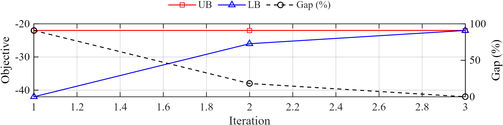
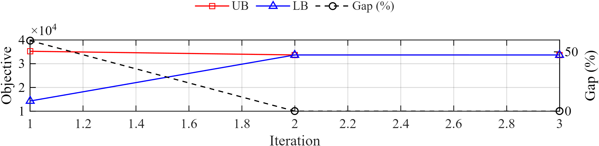

# PowerBiMIP: An Open-Source, Efficient Bilevel Mixed-Integer Programming Solver for Power and Energy Systems

[](https://github.com/GreatTM/PowerBiMIP)
[](https://docs.powerbimip.com)

**PowerBiMIP** is an open-source, efficient solver for Bilevel Mixed-Integer Programming (BiMIP), with a special focus on applications in power and energy systems.

## Overview

PowerBiMIP provides a user-friendly framework to formulate complex hierarchical optimization problems.

The toolbox currently supports:
*   **Bilevel Mixed-Integer Programs (BiMIP)**:
    *   Support for continuous and **integer variables** **at both levels**.
    *   Automatic conversion to standard forms.
    *   Handling of coupling constraints.
    *   Optimistic solution perspectives (Pessimistic perspective coming soon).
*   **Two-Stage Robust Optimization (TRO)**:
    * The subproblem of the C&CG procedure is a special BiMIP, thus can be solved by PowerBiMIP efficiently.
    * PowerBiMIP now offers a solver interface specifically designed for two-stage robust optimization requirements (currently supporting only LP recourse scenarios; MIP recourse is coming soon).
*   **Multiple Solution Methods**: Including exact modes (KKT, Strong Duality) and quick modes (Approximately 1-3 orders of magnitude faster than existing global optimal algorithms for BiMIP).
*   **Power and Energy Systems Case Library**: We are actively building a library of benchmark cases for classic BiMIP and TRO problems in power and energy systems, which will be continuously updated and expanded.

### PowerBiMIP vs. Existing Toolboxes

<table>
  <thead>
    <tr>
      <th rowspan="2" style="text-align:center">Toolbox</th>
      <th rowspan="2" style="text-align:center">Programming Platform</th>
      <th colspan="3" style="text-align:center">Model Support</th>
    </tr>
    <tr>
      <th style="text-align:center">Lower-Level<br>Integer Vars.</th>
      <th style="text-align:center">OBL</th>
      <th style="text-align:center">PBL</th>
    </tr>
  </thead>
  <tbody>
    <tr>
      <td>YALMIP</td>
      <td align="center">MATLAB</td>
      <td align="center"></td>
      <td align="center">✔</td>
      <td align="center"></td>
    </tr>
    <tr>
      <td>Pyomo/PAO</td>
      <td align="center">Python</td>
      <td align="center"></td>
      <td align="center">✔</td>
      <td align="center"></td>
    </tr>
    <tr>
      <td>BilevelJuMP</td>
      <td align="center">Julia</td>
      <td align="center"></td>
      <td align="center">✔</td>
      <td align="center"></td>
    </tr>
    <tr>
      <td>GAMS/EMP</td>
      <td align="center">GAMS</td>
      <td align="center"></td>
      <td align="center">✔</td>
      <td align="center"></td>
    </tr>
    <tr>
      <td>MibS</td>
      <td align="center">C++</td>
      <td align="center">✔</td>
      <td align="center">✔</td>
      <td align="center"></td>
    </tr>
    <tr>
      <td><strong>PowerBiMIP</strong></td>
      <td align="center"><strong>MATLAB</strong></td>
      <td align="center">✔</td>
      <td align="center">✔</td>
      <td align="center">✔</td>
    </tr>
  </tbody>
</table>

## Installation

### Prerequisites
Before installing PowerBiMIP, ensure you have the following dependencies installed:

1.  **MATLAB**: R2018a or newer.
2.  **YALMIP**: The latest version is highly recommended. You can download it from the [YALMIP GitHub repository](https://github.com/yalmip/YALMIP).
3.  **A MILP Solver**: At least one MILP solver is required. We strongly recommend **Gurobi** for its performance and robustness. Other supported solvers include CPLEX, COPT, and MOSEK.

### Installation Steps

We recommend using **GitHub Desktop** or `git` to install PowerBiMIP. This allows you to easily receive updates.

1.  **Clone the Repository**:
    *   **Using GitHub Desktop**: Clone `https://github.com/GreatTM/PowerBiMIP`.
    *   **Using Git**:
        ```bash
        git clone https://github.com/GreatTM/PowerBiMIP.git
        ```
2.  **Run Installer**:
    *   Open MATLAB.
    *   Navigate to the **PowerBiMIP root directory** (where you cloned the repo).
    *   Run the installation script in the MATLAB Command Window:
        ```matlab
        install
        ```
    *   This script will automatically add all necessary folders to your MATLAB path.

3.  **Verify Installation**:
    *   Run one of the toy examples to ensure everything is configured correctly:
        ```matlab
        run('examples/BiMIP_benchmarks/BiMIP_toy_example1.m');
        ```

### Updating
To update to the latest version, simply `Fetch origin` in GitHub Desktop or run `git pull` in your terminal.

## Quick Start Example: BiMIP

Let's walk through a simple example. The following problem is defined in `examples/BiMIP_benchmarks/BiMIP_toy_example1.m`.

**Mathematical Formulation:**

*   **Upper-Level Problem:**
    ```
    min_{x}  -x - 10*z
    s.t.
        x >= 0
        -25*x + 20*z <= 30
        x   + 2*z  <= 10
        2*x - z    <= 15
        2*x + 10*z >= 15
    ```

*   **Lower-Level Problem:**
    Where `z` is determined by the solution of:
    ```
    min_{y,z}  z + 1000 * sum(y)
    s.t.
        -25*x + 20*z <= 30 + y(1)
        x   + 2*z  <= 10 + y(2)
        2*x - z    <= 15 + y(3)
        2*x + 10*z >= 15 - y(4)
        z >= 0
        y >= 0
    ```

**MATLAB Implementation with PowerBiMIP:**

```matlab
%% 1. Initialization
dbstop if error;
clear; close all; clc; 
yalmip('clear');

%% 2. Variable Definition using YALMIP
% It's good practice to group all variables in a single struct.
model.var_upper.x = intvar(1,1,'full'); % Upper-level integer variable
model.var_lower.z = intvar(1,1,'full'); % Lower-level integer variable
model.var_lower.y = sdpvar(4,1,'full'); % Lower-level continuous variables

%% 3. Model Formulation
% --- Upper-Level Constraints ---
model.cons_upper = [];
model.cons_upper = model.cons_upper + ...
    (model.var_upper.x >= 0);
model.cons_upper = model.cons_upper + ...
    (-25 * model.var_upper.x + 20 * model.var_lower.z <= 30);
model.cons_upper = model.cons_upper + ...
    (model.var_upper.x + 2 * model.var_lower.z <= 10);
model.cons_upper = model.cons_upper + ...
    (2 * model.var_upper.x - model.var_lower.z <= 15);
model.cons_upper = model.cons_upper + ...
    (2 * model.var_upper.x + 10 * model.var_lower.z >= 15);

% --- Lower-Level Constraints ---
model.cons_lower = [];
model.cons_lower = model.cons_lower + ...
    (-25 * model.var_upper.x + 20 * model.var_lower.z <= 30 + model.var_lower.y(1,1) );
model.cons_lower = model.cons_lower + ...
    (model.var_upper.x + 2 * model.var_lower.z <= 10 + model.var_lower.y(2,1) );
model.cons_lower = model.cons_lower + ...
    (2 * model.var_upper.x - model.var_lower.z <= 15 + model.var_lower.y(3,1) );
model.cons_lower = model.cons_lower + ...
    (2 * model.var_upper.x + 10 * model.var_lower.z >= 15 - model.var_lower.y(4,1) );
model.cons_lower = model.cons_lower + ...
    (model.var_lower.z >= 0);
model.cons_lower = model.cons_lower + ...
    (model.var_lower.y >= 0);

% --- Objective Functions ---
% Note: Maximization problems should be converted to minimization problems 
% by negating the objective function.
model.obj_upper = -model.var_upper.x - 10 * model.var_lower.z;
model.obj_lower = model.var_lower.z + 1e3 * sum(model.var_lower.y,'all');

%% 4. Configure and Run the Solver
% Configure PowerBiMIP settings
ops = BiMIPsettings( ...
    'perspective', 'optimistic', ...    % Perspective: 'optimistic' or 'pessimistic'
    'method', 'exact_KKT', ...                % Method: 'exact_KKT', 'exact_strong_duality', or 'quick'
    'solver', 'gurobi', ...             % Specify the underlying MIP solver
    'verbose', 2, ...                   % Verbosity level [0:silent, 1:summary, 2:summary+plots]
    'max_iterations', 10, ...           % Set the maximum number of iterations
    'optimal_gap', 1e-4, ...             % Set the desired optimality gap
    'plot.verbose', 1, ...
    'plot.saveFig', false ...
    );

% Call the main solver function
[Solution, BiMIP_record] = solve_BiMIP(model, ops);
```
**Solver Output:**

```text
Welcome to PowerBiMIP V0.1.0 | © 2025 Yemin Wu, Southeast University
Open-source, efficient tools for power and energy system bilevel mixed-integer programming.
GitHub: https://github.com/GreatTM/PowerBiMIP
Docs:   https://docs.powerbimip.com
Bilevel optimization interface
--------------------------------------------------------------------------
User-specified options:
  verbose         = 2
  optimal_gap     = 0.0001
  plot__verbose   = 1
--------------------------------------------------------------------------
Starting disciplined bilevel programming process...
Welcome to PowerBiMIP V0.1.0 | © 2025 Yemin Wu, Southeast University
Open-source, efficient tools for power and energy system bilevel mixed-integer programming.
GitHub: https://github.com/GreatTM/PowerBiMIP
Docs:   https://docs.powerbimip.com
Bilevel optimization interface
--------------------------------------------------------------------------
Starting disciplined bilevel programming process...
Initial model has coupled constraints. Starting reformulation...
  Preprocessing Iteration 1...
  Applying Transformation 2: [Optimistic + Coupled] -> [Optimistic + Uncoupled]
    Using user-defined penalty kappa = 50.
Identified 4 coupled inequalities and 0 coupled equalities to transform.
Preprocessing complete. Model is now uncoupled.
Disciplined bilevel programming process completed.
Problem Statistics:
  Upper-Level Constraints: 1 (1 ineq, 0 eq), 1 non-zeros
  Lower-Level Constraints: 17 (17 ineq, 0 eq), 33 non-zeros
  Variables (Total): 8 continuous, 2 integer (0 binary)
Coefficient Ranges:
  Matrix Coefficients: [1.0e+00, 2.5e+01]
  Objective Coefficients: [1.0e+00, 1.0e+03]
  RHS Values:          [1.0e+01, 3.0e+01]
--------------------------------------------------------------------------
Solving with optimistic perspective...

-----------------------------------------------------------------------------------------------
  Iter |       MP Obj     SP1 Obj     SP2 Obj |          LB          UB         Gap |  Time(s)
-----------------------------------------------------------------------------------------------
     1 |     -42.0000      2.0000    -22.0000 |      -42.00      -22.00      90.91% |      0.4
     2 |     -26.0000      1.0000    -16.0000 |      -26.00      -22.00      18.18% |      0.6
     3 |     -22.0000      2.0000    -22.0000 |      -22.00      -22.00       0.00% |      0.8

Convergence criteria met (gap = 0.00% <= 0.01%).
-----------------------------------------------------------------------------------------------
Solution Summary:
  Objective value: -22.0000       
  Best bound:      -22.0000       
  Gap:             0.00%
  Iterations:      3
  Time elapsed:    0.78 seconds
-----------------------------------------------------------------------------------------------
```

<div align="center">
    
</div>

## Quick Start Example: Two-Stage Robust Optimization

PowerBiMIP introduces support for Two-Stage Robust Optimization (TRO). The following problem is defined in `examples/BiMIP_benchmarks/TRO_LP_toy_example1.m`.

**Mathematical Formulation:**

This example solves a **Robust Facility Location-Transportation Problem**:

*   **First-Stage Problem:** (Minimize investment + worst-case operation cost)
    ```
    min_{y,z}  sum_i (f_i*y_i + c_i*z_i) + max_{d in D} min_{x >= 0} sum_{i,j} t_{ij}*x_{ij}
    s.t.
        z_i <= 800*y_i,           for all i
        y_i in {0, 1},            for all i
        z_i >= 0, z_i >= 772,     for all i
    ```

*   **Second-Stage Problem:** (Minimize operation cost given demand `d`)
    ```
    min_{x >= 0}  sum_{i,j} t_{ij}*x_{ij}
    s.t.
        sum_j x_{ij} <= z_i,      for all i (Capacity)
        sum_i x_{ij} >= d_j,      for all j (Demand)
    ```

*   **Uncertainty Set (D):** (Budgeted uncertainty on demand `d`)
    ```
    d_j = d_nominal_j + 40*g_j
    0 <= g_j <= 1
    sum(g) <= 1.8
    g_0 + g_1 <= 1.2
    ```

**MATLAB Implementation with PowerBiMIP:**

```matlab
%% 1. Initialization
dbstop if error;
clear; close all; clc; 
yalmip('clear');

%% 2. Problem Parameters
f = [400; 414; 326];        % Fixed costs
c = [18; 25; 20];           % Capacity costs
T = [22, 33, 24;            % Transportation costs
     33, 23, 30;
     20, 25, 27];
d_nominal = [206; 274; 220];% Nominal demand
n_facilities = 3; n_demands = 3; capacity_limit = 800;

%% 3. Variable Definition
% First-stage variables
model.var_1st.y = binvar(n_facilities, 1, 'full'); 
model.var_1st.z = sdpvar(n_facilities, 1, 'full');

% Uncertainty variables
model.var_uncertain = sdpvar(n_demands, 1, 'full');    

% Second-stage variables
model.var_2nd.x = sdpvar(n_facilities, n_demands, 'full'); 

%% 4. Model Formulation

% --- First-Stage Constraints ---
model.cons_1st = [];
model.cons_1st = model.cons_1st + (model.var_1st.z >= 0); 
model.cons_1st = model.cons_1st + (sum(model.var_1st.z) >= 772); 
for i = 1:n_facilities
    model.cons_1st = model.cons_1st + (model.var_1st.z(i) <= capacity_limit * model.var_1st.y(i));
end

% --- Second-Stage Constraints ---
model.cons_2nd = [];
model.cons_2nd = model.cons_2nd + (model.var_2nd.x(:) >= 0);

% Capacity limit (Recourse)
for i = 1:n_facilities
    model.cons_2nd = model.cons_2nd + (sum(model.var_2nd.x(i, :)) <= model.var_1st.z(i));
end

% Demand satisfaction (Recourse + Uncertainty)
for j = 1:n_demands
    d_j = d_nominal(j) + 40 * model.var_uncertain(j); 
    model.cons_2nd = model.cons_2nd + (sum(model.var_2nd.x(:, j)) >= d_j);
end

% --- Uncertainty Set Constraints ---
model.cons_uncertainty = [];
model.cons_uncertainty = model.cons_uncertainty + (model.var_uncertain >= 0);
model.cons_uncertainty = model.cons_uncertainty + (model.var_uncertain <= 1);
model.cons_uncertainty = model.cons_uncertainty + (sum(model.var_uncertain) <= 1.8);
model.cons_uncertainty = model.cons_uncertainty + (model.var_uncertain(1) + model.var_uncertain(2) <= 1.2);

% --- Objective Functions ---
model.obj_1st = f' * model.var_1st.y + c' * model.var_1st.z;
model.obj_2nd = sum(sum(T .* model.var_2nd.x));

%% 5. Configure and Run the Solver
ops = TROsettings( ...
    'mode', 'exact_KKT', ...          % 'exact_KKT' or 'quick'
    'solver', 'gurobi', ...           % Underlying solver
    'verbose', 2, ...                 
    'plot.verbose', 1, ...
    'plot.saveFig', true ...
    );

% --- SOLVE ---
fprintf('Solving Robust Facility Location Problem...\n');
[Solution, Robust_record] = solve_TRO(model, ops);

%% 6. Analyze Results
if ~isempty(Solution.obj_1st)
    fprintf('\nOptimal Objective: %.4f\n', Solution.obj_1st);
    y_opt = value(model.var_1st.y);
    z_opt = value(model.var_1st.z);
    fprintf('Facility Decisions:\n');
    for i = 1:n_facilities
        if y_opt(i) > 0.5
            fprintf('  Facility %d: OPEN (Capacity: %.2f)\n', i, z_opt(i));
        else
            fprintf('  Facility %d: CLOSED\n', i);
        end
    end
end
```

**Solver Output:**

```text
Solving Robust Facility Location Problem...
Welcome to PowerBiMIP V0.1.0 | © 2025 Yemin Wu, Southeast University
Open-source, efficient tools for power and energy system bilevel mixed-integer programming.
GitHub: https://github.com/GreatTM/PowerBiMIP
Docs:   https://docs.powerbimip.com
Two-stage robust optimization interface
--------------------------------------------------------------------------
User-specified options:
  verbose         = 2
  plot__verbose   = 1
  plot__saveFig   = true
--------------------------------------------------------------------------
Robust model components extracted successfully.

-----------------------------------------------------------------------------------------------
  Iter |       MP Obj      SP Obj |          LB          UB      Gap(%) |  Time(s)
-----------------------------------------------------------------------------------------------
     1 |   14296.0000  20942.0000 |  14296.0000  35238.0000    59.4302% |    0.190
     2 |   33680.0000  18034.0000 |  33680.0000  33696.0000     0.0475% |    0.391
     3 |   33680.0000  18024.4000 |  33680.0000  33680.0000     0.0000% |    0.577

Converged! Relative gap (0.0000%) <= tolerance (0.0100%).
Figure saved to: results/figures/

-----------------------------------------------------------------------------------------------
Final Results:
  Lower Bound (LB): 33680.000000
  Upper Bound (UB): 33680.000000
  Final Gap:       0.0000%
  Total Iterations: 3
  Total Runtime:    0.705 seconds
-----------------------------------------------------------------------------------------------

Optimal Objective: 15655.6000
Facility Decisions:
  Facility 1: OPEN (Capacity: 255.20)
  Facility 2: CLOSED
  Facility 3: OPEN (Capacity: 516.80)
```

<div align="center">
    
</div>

## Documentation

For detailed documentation, including tutorials, advanced examples, and API references, please visit our official website:

**[https://docs.powerbimip.com](https://docs.powerbimip.com)**

## Development Status & Contribution

PowerBiMIP is under active development. As an early-stage project, it may have known or potential bugs, and some features are still being improved. We are committed to long-term maintenance and plan to release a major update annually and minor updates monthly.

We highly welcome feedback and contributions from the community! If you have any feature requests or encounter a bug, please feel free to:
* Contact Yemin Wu directly via email: [yemin.wu@seu.edu.cn](mailto:yemin.wu@seu.edu.cn)
* Open an issue on our [GitHub Issues page](https://github.com/GreatTM/PowerBiMIP/issues).

## Acknowledgements

This work is performed under the supervision of **Prof. Shuai Lu** ([@Shuai-Lu](https://github.com/Shuai-Lu)) and **Prof. Wei Gu** at Southeast University.

We extend our sincere gratitude to **Prof. Bo Zeng** from the University of Pittsburgh for his significant support. The algorithms implemented in PowerBiMIP are based on his pioneering research.

Furthermore, the development of the Fast-R&D algorithm (quick mode) was carefully guided by **Prof. Bo Zeng**.

We also thank **Dr. Ruizhi Yu** ([@rzyu45](https://github.com/rzyu45)) for his technical support and guidance on the development of the PowerBiMIP documentation website.

## License and Citation

### License
**Copyright © 2025 Yemin Wu (yemin.wu@seu.edu.cn), Southeast University**
Licensed for academic and non-commercial research purposes only. See [LICENSE](LICENSE) for details.

### Citation
If you use PowerBiMIP in your research, please cite our GitHub repository:

> Y. Wu, "PowerBiMIP: An Open-Source, Efficient Bilevel Mixed-Integer Programming Solver for Power and Energy Systems," GitHub repository, 2025. [Online]. Available: https://github.com/GreatTM/PowerBiMIP

**We will provide a specific citation format once our work is published in a peer-reviewed journal.**
