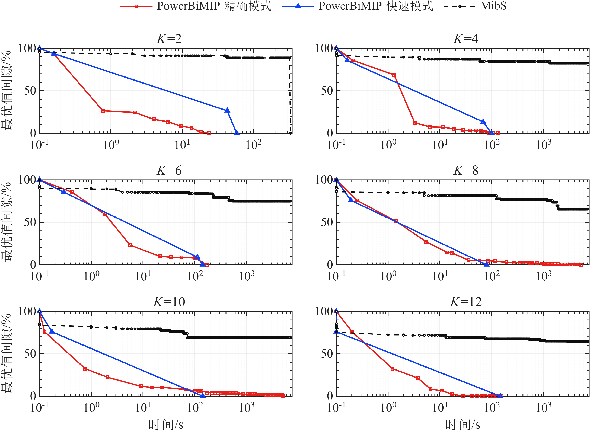
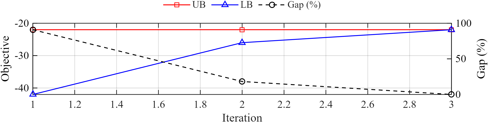
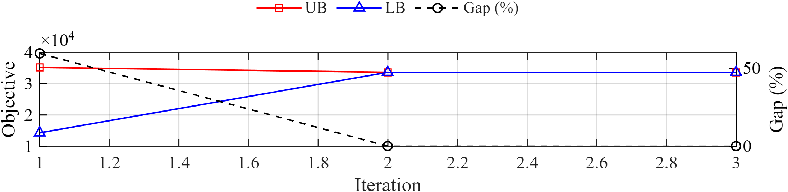

<div align="center">
  
</div>

# PowerBiMIP: 面向电力能源系统的开源高效双层混合整数规划求解器

<div align="center">

[**English**](README.md) | [**简体中文**](README_CN.md)

</div>

[](https://github.com/GreatTM/PowerBiMIP)
[](https://docs.powerbimip.com)

**PowerBiMIP** 是一个开源、高效的双层混合整数规划（BiMIP）求解器，特别专注于电力和能源系统的应用。

> **预告：Python + Pyomo 即将推出。** 我们正在开发 PowerBiMIP 的 Python 版本，即将支持 Pyomo 建模。

## 关注我们

| 技术交流群 |
| :---: |
|  |

## 概览（Overview）

PowerBiMIP 为构建复杂的层级优化问题提供了一个用户友好的框架。

该工具箱目前支持：
* **双层混合整数规划 (BiMIP)**:
    * 支持上下层同时包含连续变量和**整数变量**。
    * 乐观双层优化，且允许含有耦合约束（coupling constraints）。
    * 悲观双层优化。
* **两阶段鲁棒优化 (TRO)**:
    * C&CG 算法的子问题是一种特殊的 BiMIP，因此 PowerBiMIP 可以高效求解。
    * PowerBiMIP 现提供专为两阶段鲁棒优化需求设计的求解器接口（目前仅支持 LP 补偿场景；MIP 补偿即将推出）。
* **多种求解方法**: 包括精确模式（KKT、强对偶）和快速模式（比现有的 BiMIP 全局最优算法快约 1-2 个数量级）。
* **电力与能源系统案例库**: 我们正在积极构建电力和能源系统中经典 BiMIP 和 TRO 问题的基准案例库，并将持续更新和扩展。

### PowerBiMIP 与现有工具箱对比

<table>
  <thead>
    <tr>
      <th rowspan="2" style="text-align:center">工具箱</th>
      <th rowspan="2" style="text-align:center">编程平台</th>
      <th colspan="3" style="text-align:center">模型支持</th>
    </tr>
    <tr>
      <th style="text-align:center">下层<br>整数变量</th>
      <th style="text-align:center">乐观双层 (OBL)</th>
      <th style="text-align:center">悲观双层 (PBL)</th>
    </tr>
  </thead>
  <tbody>
    <tr>
      <td>YALMIP</td>
      <td align="center">MATLAB</td>
      <td align="center"></td>
      <td align="center"><strong>✓</strong></td>
      <td align="center"></td>
    </tr>
    <tr>
      <td>Pyomo/PAO</td>
      <td align="center">Python</td>
      <td align="center"></td>
      <td align="center"><strong>✓</strong></td>
      <td align="center"></td>
    </tr>
    <tr>
      <td>BilevelJuMP</td>
      <td align="center">Julia</td>
      <td align="center"></td>
      <td align="center"><strong>✓</strong></td>
      <td align="center"></td>
    </tr>
    <tr>
      <td>GAMS/EMP</td>
      <td align="center">GAMS</td>
      <td align="center"></td>
      <td align="center"><strong>✓</strong></td>
      <td align="center"></td>
    </tr>
    <tr>
      <td>MibS</td>
      <td align="center">C++</td>
      <td align="center"><strong>✓</strong></td>
      <td align="center"><strong>✓</strong><sup>1</sup></td>
      <td align="center"></td>
    </tr>
    <tr>
      <td><strong>PowerBiMIP</strong></td>
      <td align="center"><strong>MATLAB（Python<sup>2</sup>）</strong></td>
      <td align="center"><strong>✓</strong></td>
      <td align="center"><strong>✓</strong></td>
      <td align="center"><strong>✓</strong></td>
    </tr>
  </tbody>
</table>
<sup>1</sup> MibS目前仅支持连接变量（connecting variables）为纯整数变量的情况。

<sup>2</sup> 支持 Pyomo 建模的 Python 版本正在开发中。表中的模型支持标记对应当前 MATLAB 版本。

#### PowerBiMIP 与 MibS 的电力系统算例对比

<div align="center">
  <a href="docs/source/_static/figures/powerbimip-mibs-time-to-gap.png">
    
  </a>
</div>

**图：** IEEE one-area RTS-96 电网脆弱性分析算例在攻击预算 **K = 2、4、6、8、10、12** 下的 Time-to-gap 曲线。红色为 PowerBiMIP 精确模式，蓝色为 PowerBiMIP 快速模式，黑色虚线为 MibS。横轴为对数刻度的计算时间（秒），纵轴为报告的间隙（%）。实验设置及间隙定义详见[论文](https://doi.org/10.13334/j.0258-8013.pcsee.261230)。点击图片可查看原始分辨率。

## 安装 (Installation)

### 前置条件 (Prerequisites)
在安装 PowerBiMIP 之前，请确保已安装以下依赖项：

1.  **MATLAB**: R2018a 或更新版本。
2.  **YALMIP**: 请使用 [YALMIP GitHub 仓库](https://github.com/yalmip/YALMIP)中的较新版本。**使用 COPT 时，必须确认安装版本包含下述二次目标接口修复。**
3.  **MILP 求解器**: 至少需要一个 MILP 求解器。YALMIP 提供 Gurobi、CPLEX、COPT 和 MOSEK 等接口，请根据模型要求及可获得的许可选择求解器。**对于中国用户，我们优先推荐 COPT 作为替代方案。**

#### 中国用户的求解器选择

根据 [Gurobi 官方说明](https://support.gurobi.com/hc/en-us/articles/33982552193937-As-a-student-at-a-university-in-China-how-do-I-request-a-Free-Academic-License)，Gurobi 已停止在中国内地、香港和澳门开展免费学术许可项目，不再受理这些地区的学术许可申请。该通知针对学术许可，商业许可仍可另行咨询。我们建议受影响的用户优先考虑[杉数求解器 COPT](https://www.shanshu.ai/copt)。

#### 重要提醒：使用 COPT 前请更新 YALMIP

受影响的 YALMIP 版本存在严重的 COPT 接口问题：当二次目标矩阵非零、但至少有一列全为零时，接口可能**静默丢弃整个二次目标项，同时仍报告求解成功**。只在线性目标中出现的变量，或锥模型转换引入的辅助变量，都可能产生这样的零列。因此，相关二次模型即使报告求解成功，结果也可能错误；这并不表示所有纯线性 MILP 都受到影响。

请更新到包含 [`solvers/yalmip2copt.m` 修复](https://github.com/yalmip/YALMIP/blob/develop/solvers/yalmip2copt.m)的 YALMIP 版本。修复将 `any(interfacedata.Q)` 替换为返回标量的 `nnz(interfacedata.Q)`，同时覆盖**二次目标赋值**和**增加锥辅助变量后的矩阵维度扩展**两处判断。目前上游 `develop` 分支已包含该修复，较早的发布版本未必包含。**仅升级 COPT 本身无法修复 YALMIP 接口问题。**

更新后，请在 MATLAB 中运行 `which yalmip2copt -all`，排查是否有旧版 YALMIP 抢占搜索路径；随后重启 MATLAB，并确认实际加载的接口包含上述修正。

### 安装步骤

我们推荐使用 **GitHub Desktop** 或 `git` 来安装 PowerBiMIP。这样可以轻松获取更新。

1.  **克隆仓库**:
    * **使用 GitHub Desktop (推荐)**: Clone `https://github.com/GreatTM/PowerBiMIP`.
    * **使用 Git**:
        ```bash
        git clone [https://github.com/GreatTM/PowerBiMIP.git](https://github.com/GreatTM/PowerBiMIP.git)
        ```
2.  **运行安装程序**:
    * 打开 MATLAB。
    * 导航至仓库内的 **`matlab/` 文件夹**（例如 `cd PowerBiMIP/matlab`）。
    * 在 MATLAB 命令行窗口中运行安装脚本：
        ```matlab
        install
        ```
    * 此脚本会自动将所有必要的文件夹添加到您的 MATLAB 路径中，并清理旧目录结构残留的路径条目，因此每次更新后都可以安全地重复运行。

3.  **验证安装**:
    * 运行一个玩具示例以确保一切配置正确：
        ```matlab
        run('examples/BiMIP_benchmarks/BiMIP_toy_example1.m');
        ```

### 更新
要更新到最新版本，只需在 GitHub Desktop 中点击 `Fetch origin` 或在终端运行 `git pull`。如果某次更新移动或重命名了文件夹（例如 monorepo 重构），请在 `matlab/` 文件夹中重新运行一次 `install` 以刷新 MATLAB 路径。


## 电力系统算例库

- `examples/Vulnerability_Analysis`: RTS-96 输电线路攻击脆弱性分析算例。
  `main_Vulnerability_Analysis.m` 可运行一个简洁演示。

## 快速入门示例：BiMIP

让我们看一个简单的例子。以下问题定义在 `examples/BiMIP_benchmarks/BiMIP_toy_example1.m` 中。

**数学公式:**

* **上层问题:**
    ```
    min_{x}  -x - 10*z
    s.t.
        x >= 0
        -25*x + 20*z <= 30
        x   + 2*z  <= 10
        2*x - z    <= 15
        2*x + 10*z >= 15
    ```

* **下层问题:**
    其中 `z` 由以下问题的解决定:
    ```
    min_{y,z}  z + 1000 * sum(y)
    s.t.
        -25*x + 20*z <= 30 + y(1)
        x   + 2*z  <= 10 + y(2)
        2*x - z    <= 15 + y(3)
        2*x + 10*z >= 15 - y(4)
        z >= 0
        y >= 0
    ```

**PowerBiMIP 的 MATLAB 实现:**

```matlab
%% 1. 初始化
dbstop if error;
clear; close all; clc; 
yalmip('clear');

%% 2. 使用 YALMIP 定义变量
% 将所有变量归类到一个结构体中是一个好习惯。
model.var_upper.x = intvar(1,1,'full'); % 上层整数变量
model.var_lower.z = intvar(1,1,'full'); % 下层整数变量
model.var_lower.y = sdpvar(4,1,'full'); % 下层连续变量

%% 3. 模型构建
% --- 上层约束 ---
model.cons_upper = [];
model.cons_upper = model.cons_upper + ...
    (model.var_upper.x >= 0);
model.cons_upper = model.cons_upper + ...
    (-25 * model.var_upper.x + 20 * model.var_lower.z <= 30);
model.cons_upper = model.cons_upper + ...
    (model.var_upper.x + 2 * model.var_lower.z <= 10);
model.cons_upper = model.cons_upper + ...
    (2 * model.var_upper.x - model.var_lower.z <= 15);
model.cons_upper = model.cons_upper + ...
    (2 * model.var_upper.x + 10 * model.var_lower.z >= 15);

% --- 下层约束 ---
model.cons_lower = [];
model.cons_lower = model.cons_lower + ...
    (-25 * model.var_upper.x + 20 * model.var_lower.z <= 30 + model.var_lower.y(1,1) );
model.cons_lower = model.cons_lower + ...
    (model.var_upper.x + 2 * model.var_lower.z <= 10 + model.var_lower.y(2,1) );
model.cons_lower = model.cons_lower + ...
    (2 * model.var_upper.x - model.var_lower.z <= 15 + model.var_lower.y(3,1) );
model.cons_lower = model.cons_lower + ...
    (2 * model.var_upper.x + 10 * model.var_lower.z >= 15 - model.var_lower.y(4,1) );
model.cons_lower = model.cons_lower + ...
    (model.var_lower.z >= 0);
model.cons_lower = model.cons_lower + ...
    (model.var_lower.y >= 0);

% --- 目标函数 ---
% 注意：最大化问题应通过取反目标函数转换为最小化问题。
model.obj_upper = -model.var_upper.x - 10 * model.var_lower.z;
model.obj_lower = model.var_lower.z + 1e3 * sum(model.var_lower.y,'all');

%% 4. 配置并运行求解器
% 配置 PowerBiMIP 设置
ops = BiMIPsettings( ...
    'perspective', 'optimistic', ...    % 视角: 'optimistic'(乐观) 或 'pessimistic'(悲观)
    'method', 'exact_KKT', ...          % 方法: 'exact_KKT', 'exact_strong_duality', 或 'quick'(快速)
    'solver', 'gurobi', ...             % 指定底层 MIP 求解器
    'verbose', 2, ...                   % 详细程度 [0:静默, 1:摘要, 2:摘要+绘图]
    'max_iterations', 10, ...           % 设置最大迭代次数
    'optimal_gap', 1e-4, ...            % 设置期望的优化间隙(optimality gap)
    'plot.verbose', 1, ...
    'plot.saveFig', false ...
    );

% 调用主求解函数
[Solution, BiMIP_record] = solve_BiMIP(model, ops);

```

**求解器输出:**

```text
Welcome to PowerBiMIP V0.1.0 | © 2026 Yemin Wu, Southeast University
Open-source, efficient tools for power and energy system bilevel mixed-integer programming.
GitHub: [https://github.com/GreatTM/PowerBiMIP](https://github.com/GreatTM/PowerBiMIP)
Docs:   [https://docs.powerbimip.com](https://docs.powerbimip.com)
Bilevel optimization interface
--------------------------------------------------------------------------
User-specified options:
  verbose         = 2
  optimal_gap     = 0.0001
  plot__verbose   = 1
--------------------------------------------------------------------------
Starting disciplined bilevel programming process...
Welcome to PowerBiMIP V0.1.0 | © 2026 Yemin Wu, Southeast University
Open-source, efficient tools for power and energy system bilevel mixed-integer programming.
GitHub: [https://github.com/GreatTM/PowerBiMIP](https://github.com/GreatTM/PowerBiMIP)
Docs:   [https://docs.powerbimip.com](https://docs.powerbimip.com)
Bilevel optimization interface
--------------------------------------------------------------------------
Starting disciplined bilevel programming process...
Initial model has coupled constraints. Starting reformulation...
  Preprocessing Iteration 1...
  Applying Transformation 2: [Optimistic + Coupled] -> [Optimistic + Uncoupled]
    Using user-defined penalty kappa = 50.
Identified 4 coupled inequalities and 0 coupled equalities to transform.
Preprocessing complete. Model is now uncoupled.
Disciplined bilevel programming process completed.
Problem Statistics:
  Upper-Level Constraints: 1 (1 ineq, 0 eq), 1 non-zeros
  Lower-Level Constraints: 17 (17 ineq, 0 eq), 33 non-zeros
  Variables (Total): 8 continuous, 2 integer (0 binary)
Coefficient Ranges:
  Matrix Coefficients: [1.0e+00, 2.5e+01]
  Objective Coefficients: [1.0e+00, 1.0e+03]
  RHS Values:          [1.0e+01, 3.0e+01]
--------------------------------------------------------------------------
Solving with optimistic perspective...

-----------------------------------------------------------------------------------------------
  Iter |       MP Obj     SP1 Obj     SP2 Obj |          LB          UB         Gap |  Time(s)
-----------------------------------------------------------------------------------------------
     1 |     -42.0000      2.0000    -22.0000 |      -42.00      -22.00      90.91% |      0.4
     2 |     -26.0000      1.0000    -16.0000 |      -26.00      -22.00      18.18% |      0.6
     3 |     -22.0000      2.0000    -22.0000 |      -22.00      -22.00       0.00% |      0.8

Convergence criteria met (gap = 0.00% <= 0.01%).
-----------------------------------------------------------------------------------------------
Solution Summary:
  Objective value: -22.0000        
  Best bound:      -22.0000        
  Gap:             0.00%
  Iterations:      3
  Time elapsed:    0.78 seconds
-----------------------------------------------------------------------------------------------

```

<div align="center">

</div>

## 快速入门示例：两阶段鲁棒优化 (Two-Stage Robust Optimization)

PowerBiMIP 引入了对两阶段鲁棒优化 (TRO) 的支持。以下问题定义在 `examples/BiMIP_benchmarks/TRO_LP_toy_example1.m` 中。

**数学公式:**

此示例求解一个 **鲁棒设施选址-运输问题**:

* **第一阶段问题:** (最小化投资 + 最恶劣情况下的运行成本)
```
min_{y,z}  sum_i (f_i*y_i + c_i*z_i) + max_{d in D} min_{x >= 0} sum_{i,j} t_{ij}*x_{ij}
s.t.
    z_i <= 800*y_i,            for all i
    y_i in {0, 1},             for all i
    z_i >= 0, z_i >= 772,      for all i

```


* **第二阶段问题:** (在给定需求 `d` 下最小化运行成本)
```
min_{x >= 0}  sum_{i,j} t_{ij}*x_{ij}
s.t.
    sum_j x_{ij} <= z_i,       for all i (容量)
    sum_i x_{ij} >= d_j,       for all j (需求)

```


* **不确定集 (D):** (需求 `d` 的预算不确定性)
```
d_j = d_nominal_j + 40*g_j
0 <= g_j <= 1
sum(g) <= 1.8
g_0 + g_1 <= 1.2

```


**PowerBiMIP 的 MATLAB 实现:**

```matlab
%% 1. 初始化
dbstop if error;
clear; close all; clc; 
yalmip('clear');

%% 2. 问题参数
f = [400; 414; 326];        % 固定成本
c = [18; 25; 20];           % 容量成本
T = [22, 33, 24;            % 运输成本
     33, 23, 30;
     20, 25, 27];
d_nominal = [206; 274; 220];% 名义需求
n_facilities = 3; n_demands = 3; capacity_limit = 800;

%% 3. 变量定义
% 第一阶段变量
model.var_1st.y = binvar(n_facilities, 1, 'full'); 
model.var_1st.z = sdpvar(n_facilities, 1, 'full');

% 不确定性变量
model.var_uncertain = sdpvar(n_demands, 1, 'full');    

% 第二阶段变量
model.var_2nd.x = sdpvar(n_facilities, n_demands, 'full'); 

%% 4. 模型构建

% --- 第一阶段约束 ---
model.cons_1st = [];
model.cons_1st = model.cons_1st + (model.var_1st.z >= 0); 
model.cons_1st = model.cons_1st + (sum(model.var_1st.z) >= 772); 
for i = 1:n_facilities
    model.cons_1st = model.cons_1st + (model.var_1st.z(i) <= capacity_limit * model.var_1st.y(i));
end

% --- 第二阶段约束 ---
model.cons_2nd = [];
model.cons_2nd = model.cons_2nd + (model.var_2nd.x(:) >= 0);

% 容量限制 (补偿/Recourse)
for i = 1:n_facilities
    model.cons_2nd = model.cons_2nd + (sum(model.var_2nd.x(i, :)) <= model.var_1st.z(i));
end

% 满足需求 (补偿 + 不确定性)
for j = 1:n_demands
    d_j = d_nominal(j) + 40 * model.var_uncertain(j); 
    model.cons_2nd = model.cons_2nd + (sum(model.var_2nd.x(:, j)) >= d_j);
end

% --- 不确定集约束 ---
model.cons_uncertainty = [];
model.cons_uncertainty = model.cons_uncertainty + (model.var_uncertain >= 0);
model.cons_uncertainty = model.cons_uncertainty + (model.var_uncertain <= 1);
model.cons_uncertainty = model.cons_uncertainty + (sum(model.var_uncertain) <= 1.8);
model.cons_uncertainty = model.cons_uncertainty + (model.var_uncertain(1) + model.var_uncertain(2) <= 1.2);

% --- 目标函数 ---
model.obj_1st = f' * model.var_1st.y + c' * model.var_1st.z;
model.obj_2nd = sum(sum(T .* model.var_2nd.x));

%% 5. 配置并运行求解器
ops = TROsettings( ...
    'mode', 'exact_KKT', ...          % 'exact_KKT' 或 'quick'
    'solver', 'gurobi', ...           % 底层求解器
    'verbose', 2, ...                 
    'plot.verbose', 1, ...
    'plot.saveFig', true ...
    );

% --- 求解 ---
fprintf('Solving Robust Facility Location Problem...\n');
[Solution, Robust_record] = solve_TRO(model, ops);

%% 6. 分析结果
if ~isempty(Solution.obj_1st)
    fprintf('\nOptimal Objective: %.4f\n', Solution.obj_1st);
    y_opt = value(model.var_1st.y);
    z_opt = value(model.var_1st.z);
    fprintf('Facility Decisions:\n');
    for i = 1:n_facilities
        if y_opt(i) > 0.5
            fprintf('  Facility %d: OPEN (Capacity: %.2f)\n', i, z_opt(i));
        else
            fprintf('  Facility %d: CLOSED\n', i);
        end
    end
end

```

**求解器输出:**

```text
Solving Robust Facility Location Problem...
Welcome to PowerBiMIP V0.1.0 | © 2026 Yemin Wu, Southeast University
Open-source, efficient tools for power and energy system bilevel mixed-integer programming.
GitHub: [https://github.com/GreatTM/PowerBiMIP](https://github.com/GreatTM/PowerBiMIP)
Docs:   [https://docs.powerbimip.com](https://docs.powerbimip.com)
Two-stage robust optimization interface
--------------------------------------------------------------------------
User-specified options:
  verbose         = 2
  plot__verbose   = 1
  plot__saveFig   = true
--------------------------------------------------------------------------
Robust model components extracted successfully.

-----------------------------------------------------------------------------------------------
  Iter |       MP Obj      SP Obj |          LB          UB       Gap(%) |  Time(s)
-----------------------------------------------------------------------------------------------
     1 |   14296.0000  20942.0000 |  14296.0000  35238.0000     59.4302% |     0.190
     2 |   33680.0000  18034.0000 |  33680.0000  33696.0000      0.0475% |     0.391
     3 |   33680.0000  18024.4000 |  33680.0000  33680.0000      0.0000% |     0.577

Converged! Relative gap (0.0000%) <= tolerance (0.0100%).
Figure saved to: results/figures/

-----------------------------------------------------------------------------------------------
Final Results:
  Lower Bound (LB): 33680.000000
  Upper Bound (UB): 33680.000000
  Final Gap:        0.0000%
  Total Iterations: 3
  Total Runtime:    0.705 seconds
-----------------------------------------------------------------------------------------------

Optimal Objective: 15655.6000
Facility Decisions:
  Facility 1: OPEN (Capacity: 255.20)
  Facility 2: CLOSED
  Facility 3: OPEN (Capacity: 516.80)

```

<div align="center">

</div>

## 文档 (Documentation)

如需详细文档，包括教程、进阶示例，请访问我们的官方网站：

**[https://docs.powerbimip.com](https://docs.powerbimip.com)**

## 开发状态与贡献 (Development Status & Contribution)

PowerBiMIP 正处于积极开发阶段。作为一个早期项目，可能存在已知或潜在的bug，部分功能仍在改进中。我们致力于长期维护，并计划每年发布一个主要更新，每月发布次要更新。

我们热烈欢迎社区的反馈和贡献！如果您有任何功能请求或遇到 bug，请随时：

* 通过电子邮件直接联系 Yemin Wu: [yemin.wu@seu.edu.cn](mailto:yemin.wu@seu.edu.cn)
* 在我们的 [GitHub Issues 页面](https://github.com/GreatTM/PowerBiMIP/issues) 提交 Issue。

## 致谢 (Acknowledgements)

本工作是在东南大学 **陆帅 副教授** ([@Shuai-Lu](https://github.com/Shuai-Lu)) 和 **顾伟 教授** 的指导下完成的。

我们衷心感谢匹兹堡大学 **曾波 教授** 的大力支持。PowerBiMIP 中实现的算法基于他的开创性研究。

此外，Fast-R&D 算法（快速模式）的开发得到了 **曾波 教授** 的悉心指导。

我们也感谢 **俞睿智 博士** ([@rzyu45](https://github.com/rzyu45)) 在 PowerBiMIP 文档网站开发方面提供的技术支持和指导。

## 许可证与引用 (License and Citation)

### 许可证 (License)

**Copyright © 2026 Yemin Wu (yemin.wu@seu.edu.cn), Southeast University**
仅用于学术和非商业研究目的。详见 [LICENSE](https://www.google.com/search?q=LICENSE)。

### 引用我们 (Citation)

如果您在研究中使用了 PowerBiMIP，请引用以下论文：

> [1] 吴晔敏,陆帅,顾伟,等.PowerBiMIP：面向电力能源系统优化的规范化双层混合整数规划建模与求解器[J/OL].中国电机工程学报,1-18[2026-09-21].[https://doi.org/10.13334/j.0258-8013.pcsee.261230](https://doi.org/10.13334/j.0258-8013.pcsee.261230).
