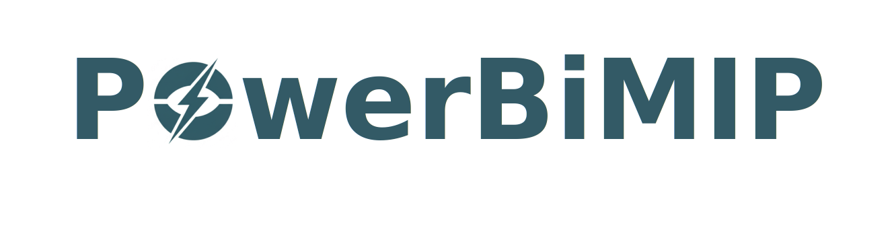

# Welcome to PowerBiMIP's Documentation!

<div class="custom-header">
    
    <p class="tagline">An open-source, efficient MATLAB toolbox for bilevel mixed-integer programming in power and energy systems.</p>
</div>

**PowerBiMIP** is a powerful, open-source MATLAB toolbox designed for researchers and engineers in the power and energy sector. It provides a user-friendly yet robust framework for modeling and solving complex bilevel mixed-integer programming (BiMIP) problems, which are essential for analyzing hierarchical decision-making processes in modern energy systems.

Whether you are modeling strategic interactions between market participants, planning resilient energy infrastructure, or exploring complex control strategies, PowerBiMIP simplifies the formulation process and provides efficient solution algorithms.

## Core Features

* **User-Friendly Modeling**: Formulate complex bilevel problems with an intuitive syntax. The toolbox automatically handles the conversion to standard BiMIP forms, letting you focus on the model itself.
* **Automatic Transformations**: Seamlessly converts BiMIP problems with coupling constraints into their uncoupled equivalents, simplifying the solution process.
* **Multiple Solution Modes**: Offers both an `exact` mode for precise, guaranteed optimal solutions and a `quick` mode for faster, heuristic solutions suitable for large-scale problems.
* **Optimistic Perspective**: Currently supports the optimistic perspective for bilevel problems, where the lower level is assumed to cooperate with the upper level. (Pessimistic perspective is coming soon).
* **Broad Solver Support**: Compatible with leading MILP solvers like **Gurobi**, CPLEX, COPT, and MOSEK.

## Getting Started

New to PowerBiMIP? The **[Getting Started](getting_started.html)** guide will walk you through solving your first bilevel optimization problem in just a few minutes.

## How to Cite

If you use PowerBiMIP in your academic work, please cite it. This support is crucial for the project's continued development and funding. A specific citation format will be provided once our accompanying paper is published.

## License & Contribution

PowerBiMIP is available for academic and non-commercial research purposes. For more details, see the **[LICENSE](https://github.com/GreatTM/PowerBiMIP/blob/main/LICENSE)** file.

We welcome community contributions! If you find a bug or have a feature request, please open an issue on our [GitHub Issues page](https://github.com/GreatTM/PowerBiMIP/issues) or contact Yemin Wu at [yemin.wu@seu.edu.cn](mailto:yemin.wu@seu.edu.cn).

```{toctree}
:maxdepth: 2
:caption: Contents:

installation
getting_started